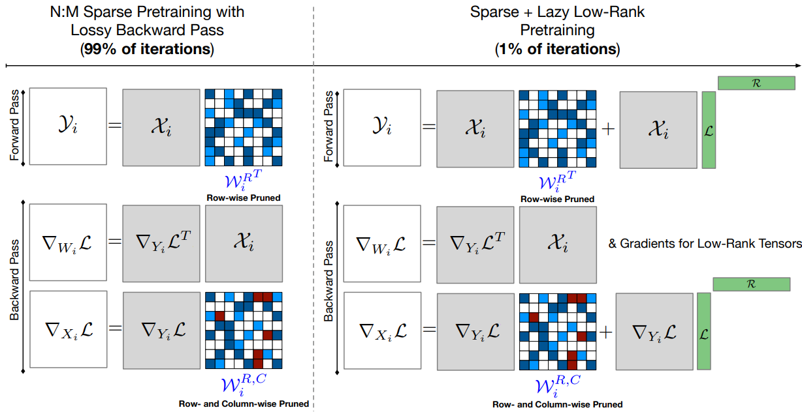

# SLoPe: Double-Pruned Sparse Plus Lazy Low-rank Adapter Pretraining

This repository contains the implementation of SLoPe (Sparse Low-rank 
Parameter-efficient adaptation), a novel method for efficient adaptation of large 
language models (LLMs). SLoPe combines sparse updates with low-rank adaptations to 
enable memory-efficient fine-tuning while maintaining model quality. The approach 
introduces a specialized optimization technique that simultaneously learns sparse 
weight updates and low-rank transformations, leveraging hardware-friendly sparsity 
patterns for accelerated training and inference. By integrating these complementary 
approaches, SLoPe achieves significant memory savings and computational efficiency 
compared to full fine-tuning, while matching or exceeding the performance of existing 
parameter-efficient methods. Our implementation demonstrates SLoPe's effectiveness 
across various model scales and downstream tasks, making it particularly valuable for 
resource-constrained environments where full model fine-tuning is impractical.

**SLoPe: Double-Pruned Sparse Plus Lazy Low-rank Adapter Pretraining**

*Mohammad Mozaffari, Amir Yazdanbakhsh, Zhao Zhang, Maryam Mehri Dehnavi*

Paper: [https://arxiv.org/abs/2405.16325](https://arxiv.org/abs/2405.16325)



## Setup

The list of requirements can be found in the requirements.txt file. To install
the requirements, run the following command:

```bash
pip install -r requirements.txt
```

## Quick Start

SLoPe uses double-pruned sparse pretraining for 99% of the training time. In the 
last 1% of training, the lazy low-rank adapters are added to the model and the
training continues till completion. We provide the details of double-pruned sparse
pretraining and the efficient implementation of low-rank adapters at inference
in two separate sections.

### Double-Pruned Sparse Pretraining

A thorough example of SLoPe pretraining can be found in 
[scripts/train.sh](scripts/train.sh). In the following, we provide a quick example 
of how to use SLoPe for pretraining a model.

After instantiating the model in the desired data type and device, we need to 
prune the model and create a sparse optimizer. Instead of using the `param.grad`, 
gradients of the weights are stored in a dictionary, called `grads_dict` because 
the size of the sparse gradients are different from the weights due to only storing 
the nonzero elements. This results in an error when using the `param.grad`. 

Setting `compress=False` in `prune_model` function will simulate sparsity, while 
keeping the weights and their transpose dense. This is useful for debugging and
testing the model before using the sparse optimizer.

Currently, only the sparse version of ADAMW is implemented, but using the same 
logic for handling sparse gradients and updating both the weight and its transpose,
other optimizers can be implemented. 

Please note that a dense optimizer is still needed to update the weights in the 
parameters of the model that are not pruned.

The mask change for the double-pruned sparse training is done in the optimizer, and 
can be provided using `mask_change_freq` parameter.

The `prune_model` function can add low-rank adapters to the model by setting
`add_lora=True` and specifying the `lora_rank`. For training, the `merge_lora` should
be set to false to allow computing the gradients for the low-rank adapters. Merging 
the low-rank adapters can be used for inference only. Please note that you have to 
manually prune the low-rank adapters.

You can also choose the backend for the SpMM operation by setting the `backend` to 
either `'cusparselt'` or `'cutlass'`. The default backend is `'cusparselt'`.

```python
from slope import prune_model, grad_dict
import torch
from optimizers.adamw_sparse import ADAMWSparse


prune_model(model, compress=True, tiling=True)
sparse_optimizer = ADAMWSparse(model, grad_dict)
optimizer = torch.optim.AdamW(model.parameters(), lr=1e-4, mask_change_freq=100)
```

After pruning the model, the training loop is similar to the standard training loop; 
the forward and backward passes are as normal, but the gradient clipping and 
synchronization need to be handled manually.

**Using HuggingFace Trainer:** The HuggingFace Trainer can only be used for the 
BF16 data type, since it does not support fully FP16 training. To use the HuggingFace
Trainer, you need to handle the gradient synchronization and clipping using the 
callbacks. When using the HuggingFace Trainer, the `max_grad_norm` should be set to
infinity to avoid clipping the gradients twice, and the desired gradient clipping
should be handled in the callback.

```python
from transformers import TrainerCallback


class SparseOptimizerCallback(TrainerCallback):
    def on_pre_optimizer_step(self, args, state, control, **kwargs):
        sparse_optimizer.clip_grad_norm(max_norm=max_grad_norm)
        sparse_optimizer.weight_decay = kwargs['optimizer'].param_groups[0]['weight_decay']
        sparse_optimizer.lr = kwargs['lr_scheduler'].get_last_lr()[0]
        sparse_optimizer.step()
        sparse_optimizer.zero_grad()
```

**Using Custom Trainer:** To use the custom trainer, you need to use the following
for synchronizing the gradients and clipping them and updating the weights. Please 
note that all the backward passes with gradient accumulation, except for the last one,
should be done with `model.no_sync()` decorator to avoid synchronizing the gradients 
in each step.

```python
from slope import sync_grads


sync_grads()
sparse_optimizer.weight_decay = optimizer.param_groups[0]['weight_decay']
sparse_optimizer.lr = scheduler.get_last_lr()[0]
sparse_optimizer.step()
optimizer.step()
sparse_optimizer.zero_grad()
optimizer.zero_grad()
scheduler.step()
```

### Efficient Sparse + Low-rank Inference

SLoPe proposes an efficient implementation of sparse + low-rank inference by merging
one of the low-rank adapters with the sparse weights and using efficient multiply 
and add kernels for computing the final results. This approach requires having the 
left low-rank adapter to be 2:4 sparse. For using the SLoPe implementation of 
the sparse + low-rank inference, you need to instantiate the model with sparse weights,
and then use the following script to add the adapters. Then you can load the weights
from the checkpoint and use the model for inference. For a more detailed example,
please refer to [scripts/inference.sh](scripts/inference.sh).

```python
from slope import prune_model


prune_model(model, compress=True, tiling=True, add_lora=True, lora_rank=128, merge_lora=True)
# Load the state dictionary from the checkpoint
```

SLoPe uses a custom triton implementation of matrix-matrix muliply and add operation, 
since the PyTorch implementation is as slow as doing the multiplication and addition 
separately.


## Performance Notes

- Using BF16 and FP16 on RTX GPUs have similar performance, but on A100 GPUs, BF16
is slower than FP16.
- Tiling usually leads to an improves speedup in comparison to not using tiling. But
in some cases in RTX machines, tiling can lead to a slowdown. We suggest testing
both settings to find the best one for your hardware.
- cuSPARSELt is leads to more speedup on A100 GPUs, while CUTLASS is faster on RTX. 
We suggest testing both backends to find the best one for your hardware.
- Currently, PyTorch only supports CUTLASS for distributed settings, and using
cuSPARSELt in distributed settings leads to an error.
- Using the PyTorch semi-structured sparsity has a significant overhead in comparison
to using a custom integration of 2:4 sparsity, but due to ease of use, we have only
provided the PyTorch implementation.
- HuggingFace does not support fully FP16 training, and stores the weights in FP32. 
For using FP16 training, you need to use the custom trainer used in this repository.
- The matrix-vector addition used in PyTorch used for adding bias is slow. As a 
- result, we have implemented a custom matrix-vector addition kernel in triton.
- The `addmm` operation in PyTorch is as slow as doing the addition and multiplication
separately. As a result, we have implemented a custom triton kernel for this operation 
for this operation.
- The `torch.matmul` does not update the output matrix when the `out` parameter is
provided in SpMM. As a result, we overwrite the output matrix by the assignment 
operation. Fixing this issue can lead to a slightly higher speedup due to lower
memory access.


## Accuracy Experiments

In our accuracy experiments, we have simulated 2:4 sparsity in dense weights. For
more details about the experiments, please refer to 
[accuracy_experiments](accuracy_experiments) folder.


## Other Performance Experiments

For a list of other performance experiments, please refer to 
[performance_experiments](performance_experiments) folder.


## Failed Optimizations 
- We have tried multiplying the different tiles on different CUDA streams, but it
did not lead to any speedup.
- Using transposable 4x4 tiles can help avoiding the mask updates in the transpose 
matrix, but it will degrade the accuracy of the model and is not recommended.


## Experiments

### Accuracy Results

We have pretrained BERT-Large-Uncased and GPT-2 using different dense and sparse pretraining 
methods. BERT is fine-tuned on GLUE and SQuAD v1.1 datasets and GPT-2 is evaluated on various 
zero-shot downstream tasks. The results are reported in the following tables.

* *r* denotes the relative rank of the low-rank adapters with respect to the hidden dimension of the model.

#### BERT-Large-Uncased Pretraining


| Dataset | Dense | *r=0* | *r=0.39%* | *r=1.56%* | *r=6.25%* |
|---------|-------|-------|-----------|-----------|-----------|
| SQuAD   | 90.44 | 89.1  | 89.1      | 89.2      | 89.5      |
| GLUE    | 80.22 | 77.4  | 77.7      | 77.8      | 78.2      |

| Sparsity Pattern (First 12 blocks - Last 12 blocks) | SQuAD (Ours) | SQuAD (Wanda) | GLUE (Ours) | GLUE (Wanda) |
|-----------------------------------------------------|--------------|---------------|-------------|--------------|
| 2:4-2:4                                             | **90.17**    | 89.93         | **79.08**   | 78.84        |
| 2:4-2:8                                             | **89.85**    | 89.55         | **79.03**   | 77.24        |
| 2:8-2:4                                             | **89.67**    | 86.57         | **75.92**   | 69.08        |


#### GPT-2 Pretraining

| Method               | Adapter Rank | MMLU ↑ | Arc Challenge ↑ | OpenBookQA ↑ | WinoGrande ↑ | HellaSwag ↑ | MathQA ↑ | PiQA ↑ | Race ↑ |
|----------------------|--------------|---------|------------------|--------------|--------------|-------------|----------|--------|--------|
| Dense                | N/A          | 22.9    | 20.7             | 16.2         | 50.6         | 28.5        | 21.8     | 59.8   | 28.4   |
| **SLoPe**            | 2.1%         | 23.0    | 19.3             | **16.4**     | **50.8**     | **27.5**    | 20.8     | **57.6**| **27.2**|
| **SLoPe**            | 0.05%        | 23.0    | **19.4**         | 16.2         | 50.5         | 27.4        | 20.8     | 57.5   | 27.1   |
| **SLoPe**            | 0            | 23.0    | 19.3             | 16.0         | 50.1         | 27.5        | 20.8     | 57.4   | 27.1   |
| **Extended SR-STE**  | 2.1%         | **24.2**| 18.3             | 14.2         | 47.5         | 26.9        | **21.4** | 55.2   | 24.2   |
| **Extended SR-STE**  | 0.05%        | 24.1    | 18.4             | 14.2         | 47.5         | 26.8        | 21.2     | 54.5   | 24.2   |
| **Extended SR-STE**  | 0            | 24.1    | 18.3             | 12.6         | 47.5         | 26.9        | 21.2     | 54.8   | 24.0   |

### Speedup Results

The following table summarizes the speedup results that different methods achieve in comparison 
to the dense pretraining. Please note that the speedups achieved by this code base can be lower
since the original results are obtained using more efficient (but less easy to use) integration
of sparse cuSPARSELt kernels.

* Training Speedup
* 
| **Model**                | **Method**      | **Training Speedup** | 
|--------------------------|-----------------|----------------------|
| **OPT-66B**              | **SLoPe**       | **1.20**             | 
|                          | **FST**         | 1.06                 | 
| **OPT-30B**              | **SLoPe**       | **1.22**             |
|                          | **FST**         | 1.07                 | 
| **OPT-13B**              | **SLoPe**       | **1.25**             | 
|                          | **FST**         | 1.10                 | 
| **OPT-6.6B**             | **SLoPe**       | **1.21**             | 
|                          | **FST**         | 1.11                 | 
| **OPT-2.6B**             | **SLoPe**       | **1.13**             | 
|                          | **FST**         | 1.09                 | 
| **LLaMA-3-8B**           | **SLoPe**       | **1.16**             |
|                          | **FST**         | 1.09                 | 
| **Mistral-v0.3-7B**      | **SLoPe**       | **1.15**             |
|                          | **FST**         | 1.07                 | 

* Inference Speedup

| **Model**                | **Method**      | **No Adapter (*r = 0*)** | **1.56% Adapter** | **6.25% Adapter** |
|--------------------------|-----------------|--------------------------|------------------------|------------------------|
| **OPT-66B**              | **SLoPe**       | **1.46**                 | **1.43**               | **1.40**               |                   |                   |
|                          | **FST**         | 1.00                     | 1.00                   | 1.00                   |                   |                   |
| **OPT-30B**              | **SLoPe**       | **1.53**                 | **1.53**               | **1.50**               |                   |                   |
|                          | **FST**         | 1.00                     | 1.00                   | 1.00                   |                   |                   |
| **OPT-13B**              | **SLoPe**       | **1.54**                 | **1.39**               | **1.36**               |                   |                   |
|                          | **FST**         | 1.00                     | 1.00                   | 1.00                   |                   |                   |
| **OPT-6.6B**             | **SLoPe**       | **1.46**                 | **1.46**               | **1.43**               |                   |                   |
|                          | **FST**         | 1.00                     | 1.00                   | 1.00                   |                   |                   |
| **OPT-2.6B**             | **SLoPe**       | **1.31**                 | **1.25**               | **1.18**               |                   |                   |
|                          | **FST**         | 1.00                     | 1.00                   | 1.00                   |                   |                   |
| **LLaMA-3-8B**           | **SLoPe**       | **1.35**                 | **1.33**               | **1.32**               |                   |                   |
|                          | **FST**         | 1.00                     | 1.00                   | 1.00                   |                   |                   |
| **Mistral-v0.3-7B**      | **SLoPe**       | **1.34**                 | **1.32**               | **1.31**               |                   |                   |
|                          | **FST**         | 1.00                     | 1.00                   | 1.00                   |                   |                   |

### Memory Reduction Results

* Training Memory Reduction

| **Model**                | **Method**      | **Training Memory Reduction** | 
|--------------------------|-----------------|------------------------------|
| **OPT-66B**              | **SLoPe**       | **0.67**                     | 
|                          | **FST**         | 1.27                         | 
| **OPT-30B**              | **SLoPe**       | **0.67**                     |
|                          | **FST**         | 1.17                         | 
| **OPT-13B**              | **SLoPe**       | **0.68**                     | 
|                          | **FST**         | 1.16                         | 
| **OPT-6.6B**             | **SLoPe**       | **0.68**                     | 
|                          | **FST**         | 1.19                         | 
| **OPT-2.6B**             | **SLoPe**       | **0.67**                     | 
|                          | **FST**         | 1.18                         | 
| **LLaMA-3-8B**           | **SLoPe**       | **0.63**                     |
|                          | **FST**         | 1.17                         | 
| **Mistral-v0.3-7B**      | **SLoPe**       | **0.68**                     |
|                          | **FST**         | 1.15                         | 


* Inference Memory Reduction

| **Model**                | **Method**      | **No Adapter (*r = 0*)** | **1.56% Adapter** | **6.25% Adapter** |
|--------------------------|-----------------|--------------------------|-------------------|-------------------|
| **OPT-66B**              | **SLoPe**       | **0.63**                 | **0.65**          | **0.70**          |
|                          | **FST**         | 1.00                     | 1.00              | 1.00              |
| **OPT-30B**              | **SLoPe**       | **0.61**                 | **0.63**          | **0.69**          |
|                          | **FST**         | 1.00                     | 1.00              | 1.00              |
| **OPT-13B**              | **SLoPe**       | **0.51**                 | **0.62**          | **0.68**          |
|                          | **FST**         | 1.00                     | 1.00              | 1.00              |
| **OPT-6.6B**             | **SLoPe**       | **0.60**                 | **0.62**          | **0.68**          |
|                          | **FST**         | 1.00                     | 1.00              | 1.00              |
| **OPT-2.6B**             | **SLoPe**       | **0.62**                 | **0.64**          | **0.70**          |
|                          | **FST**         | 1.00                     | 1.00              | 1.00              |
| **LLaMA-3-8B**           | **SLoPe**       | **0.66**                 | **0.69**          | **0.71**          |
|                          | **FST**         | 1.00                     | 1.00              | 1.00              |
| **Mistral-v0.3-7B**      | **SLoPe**       | **0.66**                 | **0.69**          | **0.65**          |
|                          | **FST**         | 1.00                     | 1.00              | 1.00              |


## Citation
If you use SLoPe in your research, please cite our paper:
```angular2html
@article{mozaffari2024slope,
  title     =   {SLoPe: Double-Pruned Sparse Plus Lazy Low-Rank Adapter Pretraining of LLMs},
  author    =   {Mozaffari, Mohammad and Yazdanbakhsh, Amir and Zhang, Zhao and Dehnavi, Maryam Mehri},
  journal   =   {arXiv preprint arXiv:2405.16325},
  year      =   {2024}
}
```