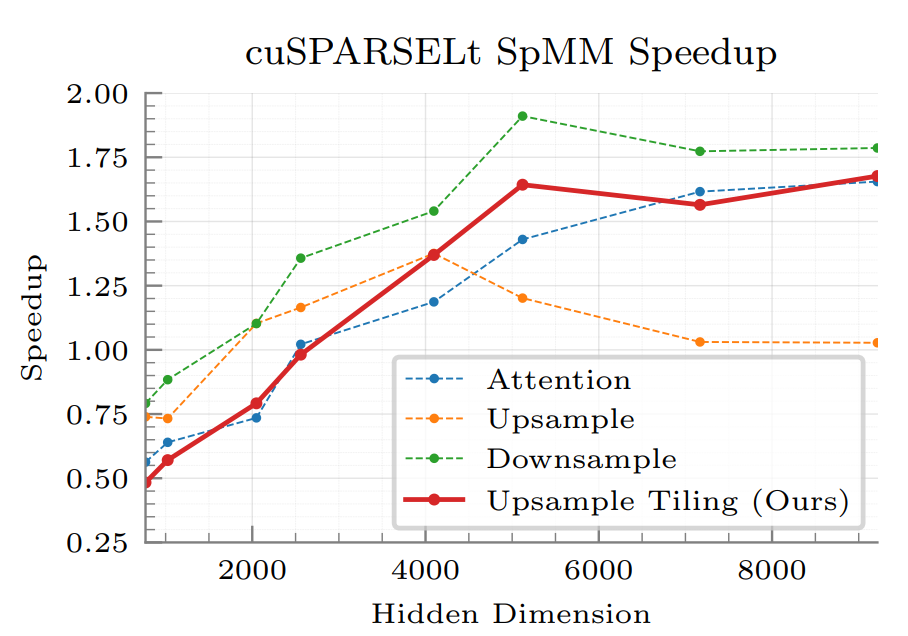
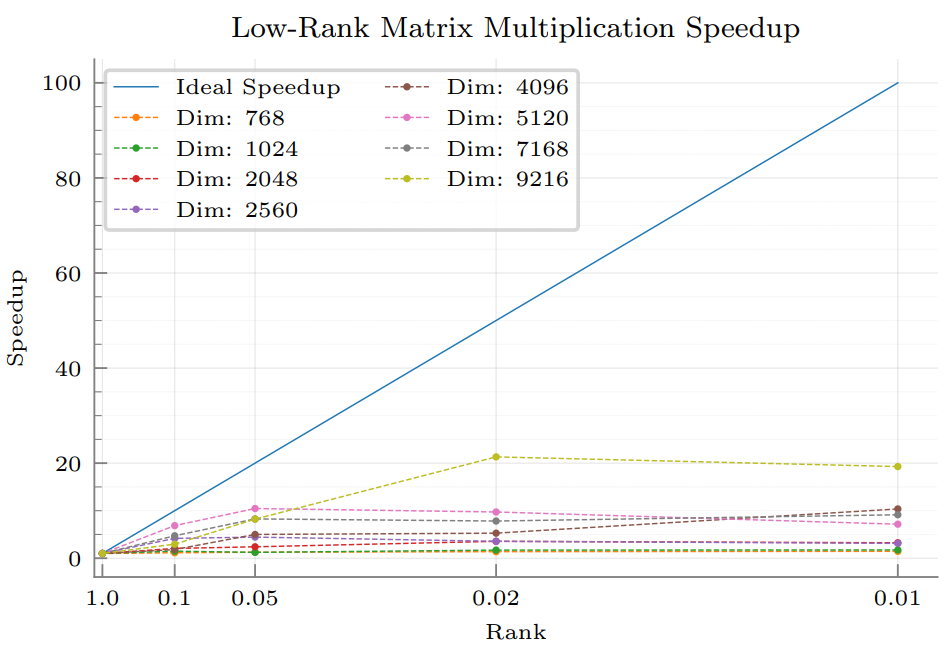
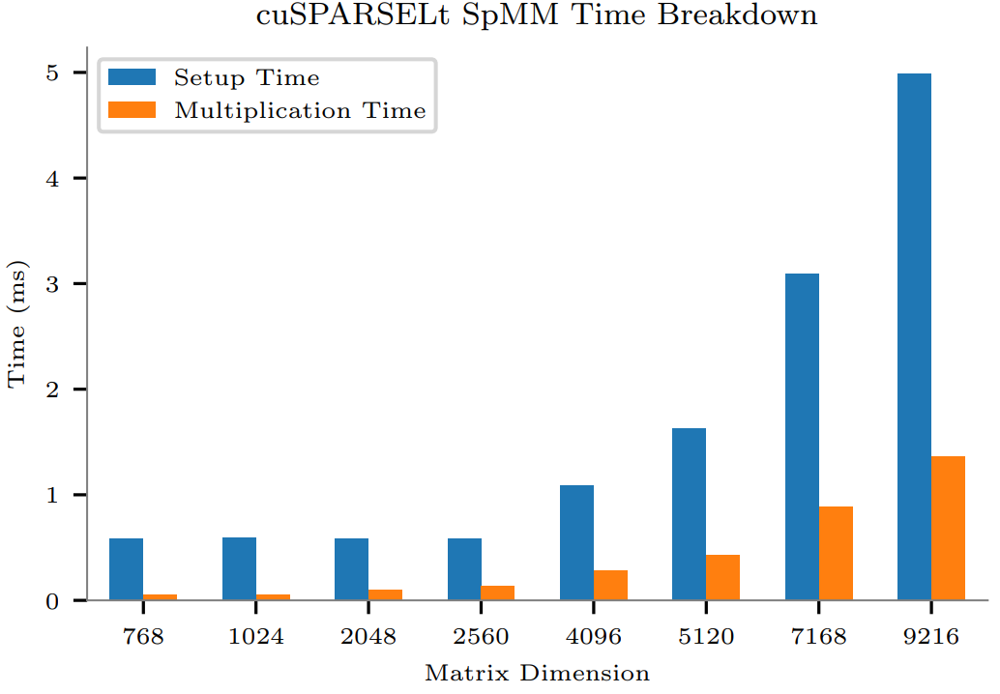

# SLoPe Performance Experiments

This folder contains the scripts for reproducing the performance experiments in the 
paper. The experiments are divided into the following categories:

## Memory Reductions

For reproducing the end-to-end memory reductions on the OPT models reported in the paper,
you can run [scripts/e2e_model_memory.sh](scripts/e2e_model_memory.sh).

For measuring the end-to-end memory reduction for each model, we store the following 
information for each layer:

Weight:
* For SLoPe, we store two sparse weights during training, and one sparse weight during 
inference.
* For FST, we store two sparse weights in addition to the dense weight during training, 
and one dense wight during inference
* For dense training and inference, we store a single dense weight.

Weight Gradients:
* For SLoPe, we store a dense gradient matrix with half the number of elements as the 
dense weight.
* For FST, we store a dense gradient matrix with the same size as the dense weight.
* For dense, we store a dense gradient matrix with the same size as the dense weight

Optimizer Metadata:
* For SLoPe, we store two matrices similar to weight gradients.
* For FST, we store two matrices similar to weight gradients.
* For dense, we store two matrices similar to weight gradients. 

Low-rank Adapters:
* For SLoPe, we merge one of the low-rank adapters in the sparse weight and 
store the other low-rank adapter separately.

| **Model**              | **Method** | **Training**          | **Inference** (No Adapter, $r$ = 0) | **Inference** (1.56% Adapter) | **Inference** (6.25% Adapter) |
|------------------------|------------|-----------------------|------------------------------------|-------------------------------|-------------------------------|
| **OPT-66B**            | SLoPe      | **0.67**              | **0.63**                           | **0.65**                      | **0.70**                      |
|                        | FST        | 1.27                 | 1.00                               | 1.00                          | 1.00                          |
| **OPT-30B**            | SLoPe      | **0.67**              | **0.61**                           | **0.63**                      | **0.69**                      |
|                        | FST        | 1.17                 | 1.00                               | 1.00                          | 1.00                          |
| **OPT-13B**            | SLoPe      | **0.68**              | **0.51**                           | **0.62**                      | **0.68**                      |
|                        | FST        | 1.16                 | 1.00                               | 1.00                          | 1.00                          |
| **OPT-6.6B**           | SLoPe      | **0.68**              | **0.60**                           | **0.62**                      | **0.68**                      |
|                        | FST        | 1.19                 | 1.00                               | 1.00                          | 1.00                          |
| **OPT-2.6B**           | SLoPe      | **0.67**              | **0.62**                           | **0.64**                      | **0.70**                      |
|                        | FST        | 1.18                 | 1.00                               | 1.00                          | 1.00                          |
| **LLaMA-3-8B**         | SLoPe      | **0.63**              | **0.66**                           | **0.69**                      | **0.71**                      |
|                        | FST        | 1.17                 | 1.00                               | 1.00                          | 1.00                          |
| **Mistral-v0.3-7B**    | SLoPe      | **0.68**              | **0.66**                           | **0.69**                      | **0.65**                      |
|                        | FST        | 1.15                 | 1.00                               | 1.00                          | 1.00                          |

## cuSPARSELt SpMM Speedup

For getting the cuSPARSELt SpMM speedups over the CUBLAS dense GEMM, you can run 
[scripts/spmm_speedup.sh](scripts/spmm_speedup.sh).  Using the `--tiling` 
flag enables the tiling strategy proposed in SLoPe to achieve high speedups in the 
Upsample matrix.

## Low-Rank Matrix Multiplication Underutilization

For reproducing the timings for low-rank adapters, you can run 
[scripts/low_rank_underutilization.sh](scripts/low_rank_underutilization.sh). 
For generating the same speedups reported in the paper, you have to divide the time of rank `1.00` by the
time taken by each rank.

## cuSPARSELt SpMM Setup Overhead

For reproducing the timings for setup and matrix multiplication in cuSPARSELt SpMM, you can run 
[scripts/setup_overhead.sh](scripts/setup_overhead.sh).

